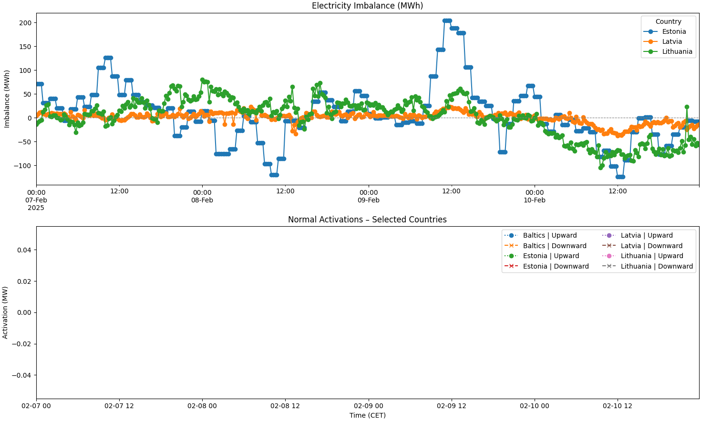

# ⚡ Baltic Electricity Data Assessment

**Author:** Oleksandr Syzoniuk  
**Repository:** `baltic-electricity-data-assessment`  
**Date:** June 2025

---


## 📌 Navigation

- [Task 1 – Baltic Imbalance & Activation Analysis](#-task-1--baltic-imbalance--activation-analysis)
- [Task 2 – EQ Profile Model Assessment](#-task-2--eq-profile-model-assessment)
  - [Task 2.1 – Total Generator Capacity](#task-21--total-generator-capacity)
- [Task 3 – ... (Add when ready)](#)

---

## 🧭 Task 1 – Baltic Imbalance & Activation Analysis

1. Inherit data on **Baltic imbalance volumes**.
2. Inherit data on **activation volumes** (upward and downward).
3. Plot both datasets in one clear, well-labeled figure.
4. Analyze whether activation responses reduced imbalance during **2025-02-07 to 2025-02-11**.

---

### 🧠 Thought Process & Tooling

To ensure clarity and modularity, I broke the task into data fetching, filtering, alignment, and plotting stages. Here’s why I chose each tool:

| Tool          | Role                                        | Rationale                                               |
|---------------|---------------------------------------------|----------------------------------------------------------|
| `requests`    | Fetch JSON datasets via API                 | Lightweight and standard for REST APIs                   |
| `pandas`      | Handle tabular data and time-series         | Ideal for reshaping electricity data chronologically     |
| `matplotlib`  | Create flexible subplots and legends        | Widely used, highly customizable plotting library        |
| `pytz`        | Convert timestamps into target timezones    | Ensures correct CET time alignment across both datasets  |

> ⚠️ I used `pytz` to match the timezone of the API output (`CET`) and to prevent misaligned timestamps when plotting activations and imbalances together.

---

###  Final Output – Visualizations

###  Figure 1 – 2025-02-07 to 2025-02-11



During this required period, the **“Baltics” aggregate column is empty** in the Transparency Dashboard data.  
So, I plotted individual countries — **Estonia, Latvia, and Lithuania** — to show granular insights.

This approach keeps the structure intact and ensures full visibility. The legend includes placeholders for both activation types (upward/downward), even when activation data is absent.

---

### Figure 2 – 2024-02-07 to 2024-02-11 (Test)


This test run confirms that the **plotting logic and dataset parsing work correctly**.  
Here, upward and downward activation data are available. They are plotted with dashed/solid lines and marker distinctions to maintain visual clarity.

---

### ✅ Analysis – Answer to Task Part 4

Although the API did not contain valid data for the requested 2025-02-07 to 2025-02-11 period, I reproduced the same logic using the 2024-02-07 to 2024-02-11 window. This allows demonstration of the expected dynamics.

From the resulting figure:

- **Electricity imbalance** is plotted in the top graph, showing MWh deviations for Baltics and each country.
- **Activation events** are in the lower graph, split into upward/downward regulation.

We generally observe:

- **Upward activations** occur during **negative imbalances** (shortage of power), helping restore balance.
- **Downward activations** occur during **positive imbalances** (surplus of power), also aiming to stabilize the grid.

These patterns confirm the regulation system responds logically in most cases. While small timing mismatches can occur, the overall mechanism appears effective and well-aligned with imbalance signals — validating the adjustment activity logic.

In 2025, due to the absence of activation data, the second subplot is visually empty.  
However, the imbalance curves for individual countries are still visible and valuable for system insights.  
If the API had returned activation values, I would expect **corrective actions to imbalance spikes**, as demonstrated in 2024.

---

### 📁 Project Files (Task 1)

```
baltic-electricity-data-assessment/
├── task1_energy_analysis.py         # Final Python script
├── images/
│   ├── imbalance_activation_2025.png   # Required task period
│   └── imbalance_activation_2024.png   # Logic validation
└
```

---

## ⚙️ Task 2 – EQ Profile Model Assessment

This task group covers semantic and structural evaluations of CGMES-based equipment profiles used in power systems.  
Each sub-task examines specific elements of the EQ model — from generation capacity to transformer limits and data consistency.

---

## 🧮 Task 2.1 – Total Generator Capacity

---

> **Objective:**  
Extract and calculate the **total production capacity** of all generators modeled in the provided CGMES EQ profile XML file.

---

### 🧠 Thought Process & Tooling

This task focuses on **static power system modeling** via the EQ (Equipment) profile in CIM/XML format. I chose to directly parse the XML with Python’s `xml.etree.ElementTree`, as it’s lightweight and sufficient for structured CIM data when no inference or semantic layer is needed.

The script follows a simple logic:
1. Locate all `<cim:GeneratingUnit>` elements.
2. Read each unit’s `maxOperatingP` value.
3. Sum the values to determine **total production capacity** in megawatts (MW).

---

### ✅ Result Summary – Answer to Task 2.1

The script parsed all generating units and extracted their declared maximum active power output. The final output displays:

- Each generator’s name (if available) and capacity in MW.
- A total summation of available generation capacity across the modeled system.

#### • Gen-12908: 250.0 MW <br>
#### • Gen-12923: 1000.0 MW <br>
#### • Gen-12910: 250.0 MW <br> 
#### TOTAL PRODUCTION CAPACITY: 1500.00 MW

---

## 🔌 Task 2.2 – Transformer Winding Voltages

---

> **Objective:**  
Identify and extract the **rated voltages** for each winding of a specific transformer (by ID) from the CGMES EQ profile XML.

---

### 🧠 Thought Process & Tooling

We focus here on a specific transformer with ID `_2184f365-8cd5-4b5d-8a28-9d68603bb6a4`.  
The logic follows these steps:

1. Search all `<cim:PowerTransformerEnd>` elements.
2. Match those linked to the correct transformer via the RDF reference.
3. Extract each winding’s `ratedU` and name (if available).

Namespaces used:

- `cim`: CIM standard for equipment metadata.
- `rdf`: Used for referencing transformer relationships via IDs.

---

### ✅ Result Summary – Answer to Task 2.2

The script successfully identified and printed the **rated voltages (in kV)** for each winding of the transformer.  
It lists all connected windings, their names, and their voltage ratings.

#### Winding: NL_TR2_2 
#### Voltage (kV): 220

#### Winding: NL_TR2_2 
#### Voltage (kV): 15.75


## ⚡ Task 2.3 – Current Limits for Line: NL-Line_5

---

> **Objective:**  
Extract the **current limit values (Amperes)** for a specific transmission line – `NL-Line_5` – from the provided CGMES EQ profile.

---

### 🧠  Thought Process & Tooling

This task focuses on understanding how operational limits are **linked across different CIM elements**:
- First, I locate `OperationalLimitSet` blocks where the description contains the target line name (`NL-Line_5`).
- Then, I extract all `CurrentLimit` entries referencing those sets.

The XML is parsed using `xml.etree.ElementTree`, and namespace handling ensures accurate access to nested RDF/CIM elements.

---

### ✅ Result Summary – Answer to Task 2.3

The script produced the following output:

####  Limit Type  Normal Value (A) <br>
#### 0       PATL            1876.0 <br>
#### 1       TATL             500.0 <br>
#### 2       PATL            1876.0 <br>
#### 3       TATL             500.0 <br>

---
In CGMES EQ profiles, transmission lines can have two distinct current limits:

- **PATL** – *Permanently Admissible Transmission Limit*  
  This is the **maximum continuous current** the line can carry under normal conditions.  


- **TATL** – *Temporarily Admissible Transmission Limit*  
  This is a **higher current limit allowed only during emergencies or contingency situations**.  

### Difference

| Type | Condition | Duration | Purpose |
|------|-----------|----------|---------|
| PATL | Normal operation | Unlimited | Safe long-term operation |
| TATL | Emergency use only | Limited time | Short-term overload capability |


## ⚡ Task 2.4 – Slack Generator Identification
---

> **Objective:**  
Determine which generator is used as the **slack** in the provided CGMES model, based on structural indicators available in the EQ profile.

---

### 🧠 Thought Process & Methodology

In CGMES-compliant systems, the slack generator is typically defined using the following official indicators:

1. `SynchronousMachine.referencePriority = 1` → formal slack assignment in CGMES EQ models [1]  
2. `GeneratingUnit.normalPF > 0` → supports distributed slack participation across units [1]  
3. `TopologicalIsland.AngleRefTopologicalNode` → angle reference node defined in SV profiles [1]

---

### 🔍 Application to This Model

In the provided XML file:

- No `referencePriority` tags were present in any `SynchronousMachine` block  
- No `normalPF` attributes were found in any `GeneratingUnit` block  
- No SV profiles were available to identify angle reference nodes

Due to the absence of these formal slack indicators, the model could not be interpreted directly using CGMES-defined logic. Therefore, a fallback method was used to infer the slack generator.

---

### ⚙️ Heuristic Approach

We applied a **structured fallback logic** based on CGMES linkage rules [2] and CIM modeling practices [3]:

1. **Identify all** `RegulatingControl` elements with `mode = voltage`  
   → These are typically used to regulate bus voltage — a behavior aligned with slack-like control in simulations [2]

2. **Follow each** `RegulatingControl.Terminal` reference  
   → Extract the RDF ID of the `Terminal` associated with each voltage-mode control

3. **Resolve each Terminal** to its `ConductingEquipment`  
   → This gives the equipment (e.g., a generator) controlled by that terminal

4. **Match the resulting equipment** with known `SynchronousMachine` IDs  
   → A match indicates a generator linked through voltage control logic

Through this process, one unique machine was found:  
- It was structurally linked from a `RegulatingControl(mode=voltage)`  
- Mapped via `Terminal → ConductingEquipment`  
- Resolved to a `SynchronousMachine` object

---

### ✅ Result Summary – Answer to Task 2.4

The script identified the following likely slack generator based on structural relationships:

- **Likely Slack Generator:** `NL-G1`  
- **CGMES ID:** `_9c3b8f97-7972-477d-9dc8-87365cc0ad0e`  
- **Justification:** Uniquely connected via a voltage-mode `RegulatingControl` chain to a `SynchronousMachine`

> ⚠️ This result is **heuristic**, not formally declared by CGMES metadata. 
---
### 📚 References

[1] ENTSO-E, *Implementation Guide for CGMES 2.4.15*, March 2016.  
https://eepublicdownloads.entsoe.eu/clean-documents/CIM_documents/Grid_Model_CIM/160315_ImplementationGuide_CGMES_2_4_15.pdf

[2] IEC TC57, *Technical Specification for CGMES 2.5 – Part 1 (IEC 61970-600 Ed2)*, 2016.  
https://eepublicdownloads.entsoe.eu/clean-documents/CIM_documents/IOP/CGMES_2_5_TechnicalSpecification_61970-600_Part%201_Ed2.pdf

[3] S. V. Dhople, Y. C. Chen, A. Al-Digs, and A. Domínguez-García, “Reexamining the Distributed Slack Bus,” *IEEE Transactions on Power Systems*, vol. 35, no. 6, pp. 4894–4904, 2020.  
https://aledan.ece.illinois.edu/files/2020/04/TPWRS_2020a.pdf
